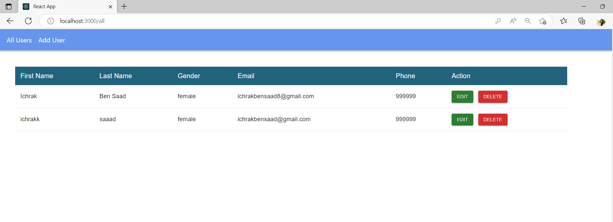
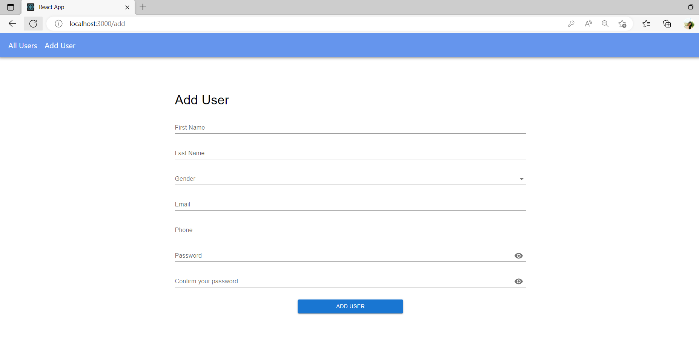

# MERN CRUD Application
Built with the MERN stack (MongoDB, Express, React and NodeJS).


 
## Key Features
* Authentication using jsonwebtoken (jwt) ,Google auth and Github
* Multiple user registration
* Account confirmation with email
* Reset password feature
* Manage tasks add update and delete tasks
* Display all tasks
 


# Technologies used
This project was created using the following technologies.

**Client**

* React JS
* Redux toolkit (for managing and centralizing application state)
* React-router-dom (To handle routing)
* Axios (for making api calls)
* Material UI & CSS Module 
* Formik (Build forms in React)
* yup (Forms validation)

**Server**

* Express
* Mongoose
* JWT (For authentication)
* bcrypt (for data encryption)
* Nodemailer (for sending invoice via email)
* Express Validator (middleware for server-side data validation)
* passport-github2
* passport-google-oauth20

**Database**

* MongoDB (MongoDB Atlas)

# Configuration and Setup
In order to run this project locally, simply fork and clone the repository or download as zip and unzip on your machine.

* Open the project in your prefered code editor.
* Go to terminal -> New terminal (If you are using VS code)
* Split your terminal into two (run the client on one terminal and the server on the other terminal)
 
In the first terminal
```
$ cd front
$ npm install (to install client-side dependencies)
$ npm start (to start the client)
```
In the second terminal


$ cd backend 
$ cd server
$ npm install --force (to install server-side dependencies)
$ npm start (to start the server)
```
ATLAS_URI = 
JWT_SEC = 
EMAIL =
PASSWORD =
PORT = 5000
GOOGLE_CLIENT_ID =
GOOGLE_CLIENT_SECRET =
GOOGLE_CALLBACK_URL  =
GIT_CLIENT_ID =
GIT_CLIENT_SECRET =
GIT_CALLBACK_URL  =
```
```
